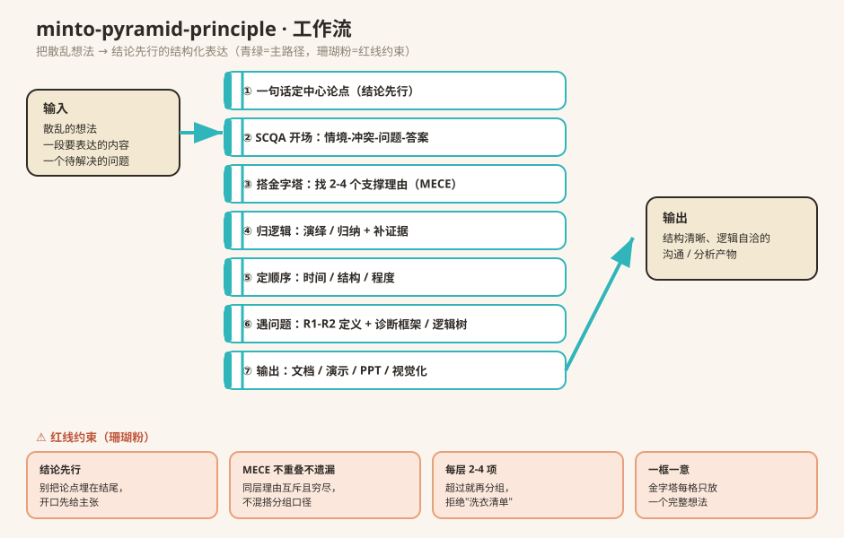

# Minto Pyramid Principle · 金字塔原理

> 把"想不清楚、说不明白"变成"结论先行、逻辑自洽"的结构化表达。一份覆盖金字塔搭建、问题定义、诊断框架与演示方法的完整结构化思维框架（共 12 章 + 速查表 + 模式库）。

## 一句话定位

当你要写报告、做汇报、分析一个问题，却理不清"先说啥、凭啥、怎么排"时，这个 Skill 把零散想法组织成「顶部一个结论、下面 2-4 条支撑、再下面证据」的金字塔，让你开口就让人懂。

## 它怎么帮你（对照表）

| 你遇到的窘境 | 用哪块能力 | 它能给你 |
|---|---|---|
| 写了一堆，别人不知道重点 | 结论先行 + 金字塔结构 | 一句话点明主张，下面逐层支撑 |
| 开头平淡、抓不住注意力 | SCQA 叙事开场 | 情境-冲突-问题-答案，三句抓住人 |
| 理由列了一长串，杂而无序 | MECE 归类 + 每组 2-4 项 | 互不重叠、没有遗漏的分组 |
| 不知道"为什么先讲这条" | 演绎/归纳 + 排序规则 | 时间/结构/程度，顺序有依据 |
| 问题说不清，瞎给方案 | R1-R2 问题定义 + 诊断框架/逻辑树 | 先框定问题，再找根因 |
| 演示 PPT 文字堆成山 | 每页一意 + 标题即论点 | 一页一个主张，视觉来支撑 |

## 核心框架（5 大件）

1. **金字塔结构**：顶 = 中心论点，中 = 2-4 条支撑，底 = 证据、细节。
2. **SCQA 开场**：情境（Situation）→ 冲突（Complication）→ 问题（Question）→ 答案（Answer）。
3. **纵向逻辑**：演绎（一般→具体，三段论）/ 归纳（具体→一般，共性总结）。
4. **横向逻辑**：MECE —— 互斥（Mutually Exclusive）、穷尽（Collectively Exhaustive）、同类。
5. **问答对话**：每句抛出一个问题，下一层回答它，把读者"拽"着走。

## 工作流（一图看懂）

见顶部示意图。概括成一条主路径：

**输入（散乱想法）→ ①定论点 → ②SCQA 开场 → ③搭金字塔(MECE) → ④归逻辑+补证据 → ⑤定顺序 → ⑥遇问题用 R1-R2+诊断框架 → ⑦输出（文档/演示/PPT）→ 结构清晰、逻辑自洽的产物**

## 怎么用

1. 先用一句话说出你的结论——**说不出 = 还没想清**。
2. 找 2-4 个支撑理由，用 MECE 检查是否重叠 / 遗漏。
3. 每个理由补证据，用演绎或归纳串起来。
4. 遇复杂问题：先 R1-R2 框定，再用诊断框架 / 逻辑树找根因。
5. 汇报时用「每页一意」，标题直接写论点而非话题。

## 适用 / 不适合

- ✅ 写报告、做提案、邮件给领导、分析问题、团队对齐。
- ❌ 纯创意发散（它需要收敛成结构）；不需要逻辑对齐的闲聊。

## 文件结构

- `SKILL.md` — 总纲、5 大框架与决策规则
- `chapters/ch01–ch12` — 12 章详解（基础→搭建→SCQA→推理→排序→问题定义→诊断框架→书面/演示/视觉化）
- `cheatsheet.md` — 11 张决策表 + 模板（邮件、执行摘要）
- `patterns.md` — 框架模式库（SCQA、金字塔、逻辑树、PPT 设计等）
- `glossary.md` — 术语表

## 想"拆开看它怎么设计的"？

用 **[skill-breakdown](https://github.com/huangluke89757/skill-breakdown)** 反向拆解本 Skill，看它的「交付定义 / 动作链 / 因果顺序 / 责任图 / 风险约束 / 原则」—— 会用是术，会拆是道。
